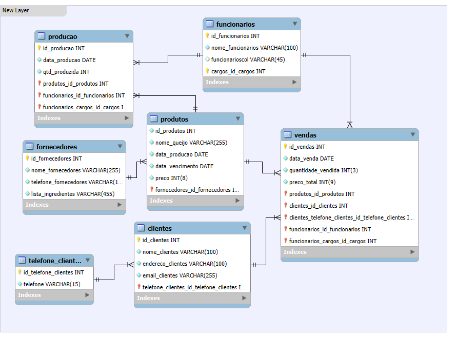

# Documentação do Projeto: Sabores da Fazenda

## 1. Introdução

### 1.1. Visão Geral
O projeto "Sabores da Fazenda" tem como objetivo desenvolver um sistema de gestão para uma queijaria, permitindo a administração eficiente da produção, estoque, vendas e clientes. Esta documentação aborda a arquitetura e implementação dos bancos de dados, bem como as alterações necessárias para integrar o front-end desenvolvido anteriormente.

### 1.2. Objetivos do Projeto
- Criar bancos de dados relacionais para gerenciar todos os aspectos da queijaria.
- Implementar funcionalidades de controle de produção, estoque e vendas.
- Integrar os bancos de dados com o front-end existente, possibilitando uma interface amigável para os usuários.

## 2. Requisitos do Sistema

### 2.1. Requisitos Funcionais
- Gerenciamento de Produtos
- Registro de Produções
- Gestão de Vendas
- Cadastro de Clientes e Fornecedores
- Emissão de Relatórios

### 2.2. Requisitos Não Funcionais
- Segurança dos Dados
- Performance e Escalabilidade
- Usabilidade
- Confiabilidade

## 3. Arquitetura dos Bancos de Dados

### 3.1. Modelo Entidade-Relacionamento (ER)
Desenho do diagrama ER com as principais entidades e seus relacionamentos, distribuídos nos seguintes bancos de dados:

#### 3.1.1. Banco de Dados de Recursos Humanos
- **Tabela de Funcionários**
  - `id_funcionario` (chave primária)
  - `nome_funcionario`
  - `cargo`
  - `data_contratacao`
  - `id_departamento` (chave estrangeira)

- **Tabela de Cargos**
  - `id_cargo` (chave primária)
  - `nome_cargo`
  - `salario`

- **Tabela de Departamentos**
  - `id_departamento` (chave primária)
  - `nome_departamento`

#### 3.1.2. Banco de Dados de Vendas e Clientes
- **Tabela de Vendas**
  - `id_venda` (chave primária)
  - `data_venda`
  - `id_produto` (chave estrangeira)
  - `quantidade_vendida`
  - `preco_total`
  - `id_cliente` (chave estrangeira)

- **Tabela de Clientes**
  - `id_cliente` (chave primária)
  - `nome`
  - `endereco`
  - `telefone`
  - `email`

- **Tabela de Telefones de Clientes**
  - `id_telefone_cliente` (chave primária)
  - `telefone`

#### 3.1.3. Banco de Dados de Produção e Fornecedores
- **Tabela de Produção**
  - `id_producao` (chave primária)
  - `data_producao`
  - `qtd_produzida`
  - `id_produto` (chave estrangeira)
  - `id_funcionario` (chave estrangeira)
  - `id_cargo_funcionario` (chave estrangeira)

- **Tabela de Fornecedores**
  - `id_fornecedor` (chave primária)
  - `nome_fornecedor`
  - `telefone_fornecedor`
  - `lista_ingredientes`

- **Tabela de Produtos**
  - `id_produto` (chave primária)
  - `nome_queijo`
  - `data_producao`
  - `data_vencimento`
  - `preco`
  - `id_fornecedor` (chave estrangeira)

#### 3.1.4. Banco de Dados de Matéria-Prima
- **Tabela de Gado**
  - `id_gado` (chave primária)
  - `identificacao`
  - `raca`
  - `data_nascimento`
  - `id_fornecedor` (chave estrangeira)

- **Tabela de Pomares**
  - `id_pomar` (chave primária)
  - `localizacao`
  - `tipo_fruta`
  - `quantidade_arvores`

### 3.2. Tabelas e Estrutura
As tabelas estão detalhadas na seção 3.1, com campos e relacionamentos específicos para cada banco de dados.

## 4. Integração com o Front-end

### 4.1. Descrição do Front-end
O front-end foi desenvolvido utilizando HTML, CSS e JavaScript (puro), fornecendo uma interface intuitiva para os usuários da queijaria.

### 4.2. Alterações Necessárias
- Implementar a API (RESTful ou GraphQL) para conectar os bancos de dados ao front-end.
- Ajustar o front-end para consumir os dados da API e refletir as informações dos bancos de dados.
- Testar e validar a integração para garantir a consistência dos dados e a funcionalidade do sistema.

## 5. Funcionalidades do Sistema

### 5.1. Gerenciamento de Produtos
- Cadastro, edição e exclusão de produtos.
- Visualização de informações detalhadas dos queijos.

### 5.2. Registro de Produções
- Registro diário de produções, incluindo quantidade e tipo de queijo produzido.
- Associação de produções aos funcionários responsáveis.

### 5.3. Gestão de Vendas
- Registro de vendas e relatórios de vendas.
- Cadastro e gestão de informações dos clientes.

### 5.4. Relatórios
- Emissão de relatórios de produção, vendas e estoque.
- Análises detalhadas para suporte à tomada de decisões.

### 5.5. Gestão de Matéria-Prima
- Registro e controle de gado e pomares.
- Gerenciamento de fornecedores de matéria-prima.

## 6. Segurança e Backup

### 6.1. Estratégias de Segurança
- Implementação de políticas de acesso e autenticação de usuários.
- Criptografia de dados sensíveis.

### 6.2. Backup de Dados
- Políticas de backup e recuperação de dados para garantir a integridade das informações.

## 7. Conclusão

### 7.1. Próximos Passos
- Finalização da integração dos bancos de dados com o front-end.
- Testes de usabilidade e performance.
- Implementação das melhorias identificadas durante a fase de testes.

### 7.2. Considerações Finais
O projeto "Sabores da Fazenda" visa otimizar a gestão da queijaria através de um sistema robusto e integrado, garantindo eficiência e qualidade na produção e comercialização dos produtos.

